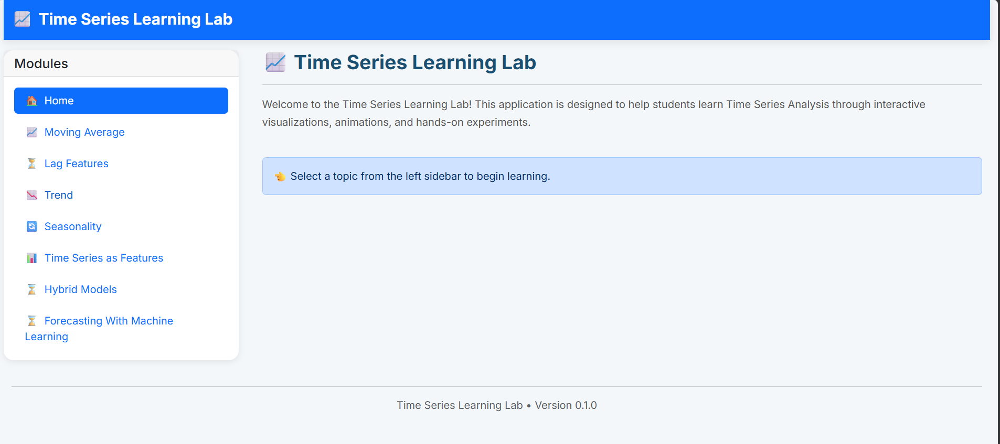
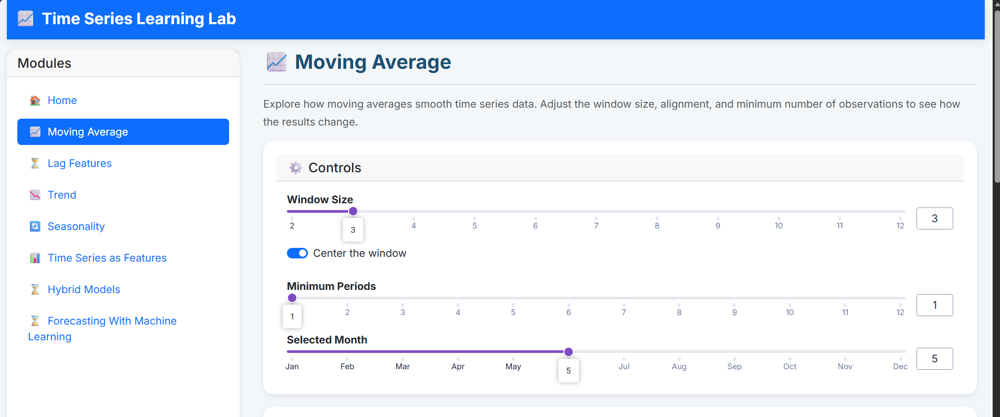

# 📈 Time Series Learning Lab — Interactive Dashboard

An interactive educational dashboard for exploring and understanding **Time Series Analysis concepts** based on the [Kaggle Time Series Course](https://www.kaggle.com/learn/time-series).

This project is designed as a practical learning laboratory where theoretical concepts from time series forecasting are transformed into interactive visual experiences. The goal is to make time series topics easier to understand through dynamic charts, explanations, mathematical formulas, and hands-on examples.

## Dashboard



---

## 🚀 Project Overview

Time series analysis is one of the most important areas in data science, with applications in:

- Sales forecasting
- Demand prediction
- Inventory optimization
- Financial forecasting
- Energy consumption prediction
- Business intelligence

This repository contains an interactive learning dashboard that demonstrates fundamental time series concepts step by step.

Instead of only presenting code notebooks, this project aims to create a structured learning environment where users can:

- Understand the intuition behind time series components
- Visualize patterns in data
- Explore forecasting techniques interactively
- Connect mathematical concepts with practical implementation

---

## 🎯 Objectives

The main objectives of this project are:

- Convert Kaggle Time Series Course concepts into an interactive application
- Build a visual learning platform for time series analysis
- Explain mathematical concepts through intuitive examples
- Provide reusable components for future forecasting projects
- Practice software engineering principles while developing a data science application

---

## 📚 Covered Topics

The dashboard will gradually include different modules from the Time Series course:

- Moving averages
- Lag Features
- Trend
- Seasonality (Fourier features)
- Time series features (time dependence vs. serial dependence)
- Hybrid models
- Forecasting with Machine learning approaches

## Moving Average Explorer


  
---

## 🖥️ Dashboard Features

The application is designed with interactive components:

### Interactive Visualizations

- Time series plots
- Trend visualization
- Seasonal pattern analysis
- Residual analysis
- Forecast comparison charts

## 🛠️ Technologies

The project uses Python-based data science tools:

- Python
- Pandas
- NumPy
- Matplotlib
- Plotly
- Dash / Streamlit (depending on module implementation)
- Scikit-learn

Additional libraries may be added as the project grows.

```markdown
```bash
pip install -r requirements.txt

---

## 📖 Learning Reference

Main learning source:

**Kaggle — Time Series Course**

Topics and examples in this repository are inspired by the Kaggle educational material and expanded into a practical interactive environment.

---

## 👤 Author

Developed as a personal data science learning project.

The purpose of this repository is not only to implement forecasting techniques but also to build a deeper understanding of time series analysis through visualization and experimentation.

---

⭐ If you find this project useful, feel free to explore, learn, and contribute.
